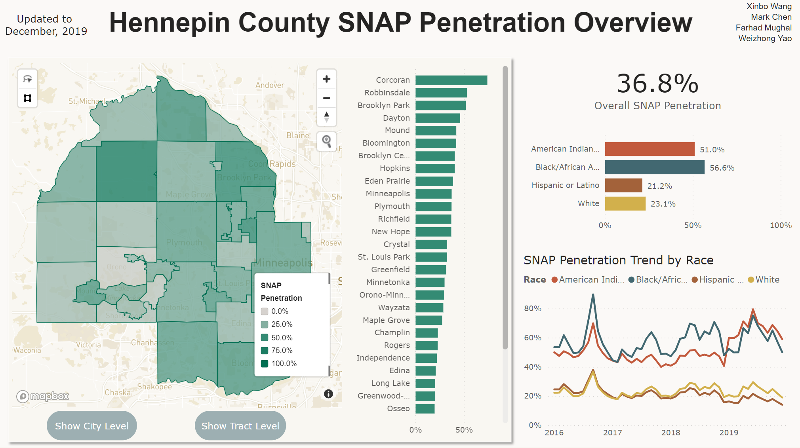

# SNAP-Penetration-for-Hennepin-County
>[Xinbo Wang](https://github.com/xinbo-hubert-wang), [Farhad Mughal](https://github.com/farhadmughal), Mark Chen, [Weizhong Yao](https://github.com/WeizhongYao)

Please See the [Power BI Dashboard](https://app.powerbi.com/view?r=eyJrIjoiYzRmNTdjYWQtMDE4ZS00ZDYxLWFmYmMtNDZiYzZlMmNjMDdjIiwidCI6Ijc3YjRmOGFkLWY2MmEtNGUzYS05OWFmLTAwM2RhNzYwMDQ3YyIsImMiOjF9&pageName=ReportSection).

## Background

[SNAP](https://www.fns.usda.gov/snap/supplemental-nutrition-assistance-program) (Supplemental Nutrition Assistance Program), formerly yet still commonly known as the Food Stamp Program, is a federal program that provides food-purchasing assistance for low- and no-income people. (see [Wiki](https://en.wikipedia.org/wiki/Supplemental_Nutrition_Assistance_Program)).

As the most populous county in Minnesota (where UoM is located), Hennepin County is interested in improving the SNAP program's coverage among eligible people within the county. However, without a clear definition of success, the county is struggling in their performance measurement and identifying where to start for improvement. 

Therefore, the county reached out to the university's Carlson Analytics Lab and made the problem a final live case for our first semester in the MSBA program. After several weeks' problem defining and solution developing, we delivered our presentation to the county on Dec 14. After the delivery, the county generously approved sharing the data and results online, which made it possible for publishing this repository. 

We recognize that the task of estimating eligibility itself is not easy and could use much more refinements, but the idea is to do it as accurately as possible so that further analysis and insights can have a sounder ground. This repository will serve as a means of sharing the technical details of our solution including the data pipeline, dashboard, and documentation. More importantly, we hope this could be a way for more people to know and become interested in the SNAP program, and potentially help improving the eligibility estimations. Other counties that are interested in their SNAP penetration rate might also find this repository helpful for inspiration.

## Data Sources

The repository mainly use three groups of data sources grouped by purposes:
1. Geographical data: including the geometries and land area data for the cities and tracts within the county.
2. SNAP registration data: generously provided by Hennepin County, down to the level for each month, tract, and race.
3. Census survey data: used for estimating eligibility by household income and adjustments.

## The Solution Files

Our solution is mainly divided into three parts in two notebooks and one Power BI dashboard.

1. Calculating the penetration rate, which is the core of this repository. The notebook [calculate_penetration_rate.ipynb](calculate_penetration_rate.ipynb) contains the full detail of our methodology as well as the data pipeline that guides you from data acquisition (mainly from the census API) to outputing the results.
2. Preparing the geo mapping and outputing the geojson files for visualization. This part is discussed in detail in the notebook [hennepin_tracts_geo_info.ipynb](hennepin_tracts_geo_info.ipynb).
3. The Power BI dashboard [pbix file](https://github.com/xinbo-hubert-wang/SNAP-Penetration-for-Hennepin-County/blob/main/SNAP%20Penetration%20Rate%20Dashboard.pbix), which is the development file of the [dashboard](https://app.powerbi.com/view?r=eyJrIjoiYzRmNTdjYWQtMDE4ZS00ZDYxLWFmYmMtNDZiYzZlMmNjMDdjIiwidCI6Ijc3YjRmOGFkLWY2MmEtNGUzYS05OWFmLTAwM2RhNzYwMDQ3YyIsImMiOjF9&pageName=ReportSection). To open the file in your computer, you need to first install [Power BI Desktop](https://powerbi.microsoft.com/en-us/desktop/) which is free for development purposes.

## How to Implement the Solution

### The Pipelines
Most of the data pipelines in the two notebooks are commented through the steps (through python comments or notebok markdown) and time range can be easily managed by changing several parameters. Therefore, it should be reletively easy to implement the pipeline for incremental updates for the later where the notebook does not cover. However, the pipelines don't take care of changes in the API dictionary (which is possible but should be rare). Therefore, it should be the first thing to check if the pipeline breakdown unexpectedly. 

### The Dashboard
The logic of the dashboard is relatively simple because we have taken care of most of the data transforming and modelling in the pipeline and the data connection should also be quite straight forward (although cloud-based storage of the results is highly recommended if you want to take advantage of Power BI Service Platform). However, there is one thing to note about the map connection.

The map visual used in the dashboard is [Mapbox](https://www.mapbox.com/), which is a popular map service and provides very flexible support for Power BI but requires a token and a customed map tile uploaded to the service. The free map loads provided by the service should be more than sufficient for our current purpose. However, it might take some time to figure out the configuration if you are new to the visual and the service. Currently the pbix uses my personal mapbox token. If you wish to change it to your token, take the steps below:
1. Sign up a free account at Mapbox;
2. Create the two customed tiles using the two geojson files outputed by hennepin_tracts_geo_info.ipynb;
3. Go to the format tab of the map visual in pbix and replace the token and url to the customed tiles (be sure that the link are in required format (starting with "mapbox://").

If you are not into using the Mapbox Service, it's also possible to use the "Shape Map" visual provided by Power BI. Shape Map is still in preview as of now (2020.12.25) so you need to manually check the functionality in the setting of PBI Desktop. Shape Map also requires geometries in topojson files, so the outputed geojson files need to be converted before being used.
